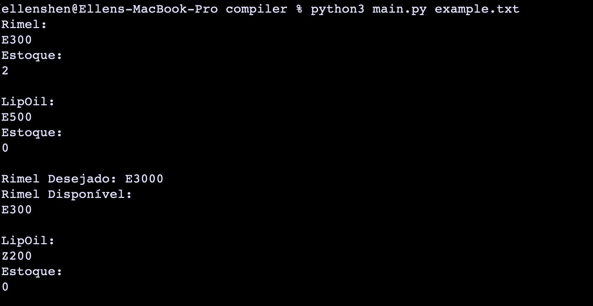

# APS Lógica da Computação

## Feito por:

- Ellen Shen

## EBNF

``` 

PROGRAM = STATEMENT_LIST ;

STATEMENT_LIST = {STATEMENT}, STATEMENT_LIST;


LETTER = ( a | ... | z | A | ... | Z ) ;

DIGIT = ( 1 | 2 | 3 | 4 | 5 | 6 | 7 | 8 | 9 | 0 ) ;

STRING = '"', { LETTER | DIGIT | " " | "_" }, '"' ;

NUMBER = DIGIT, { DIGIT } ;

IDENTIFIER = LETTER, { LETTER | DIGIT | "_" } ;

BUY = "buy", SERIAL;

ITEM = "item", IDENTIFIER, ":", SERIAL;

BRAND = LETTER, DIGIT;


BLOCK = "{", {STATEMENT}, "}" ;

STATEMENT = ( λ | ASSIGNMENT | PRINT | IF | WHILE | SHOOT | POSITION | FUNCTION_CALL | FUNCTION_DECLARATION), "\n" ;

TERM = FACTOR, { ("*" | "/"), FACTOR } ;

FACTOR = (("+" | "-"), FACTOR) | NUMBER | "(", EXPRESSION, ")" | IDENTIFIER ;


ASSIGNMENT = IDENTIFIER, "=", EXPRESSION ;

PRINT = "print", "(", EXPRESSION, ")" ;

IF = "if", "(", CONDITION, ")", BLOCK, [ "else", BLOCK ] ;

WHILE = "while", "(", CONDITION, ")", BLOCK ;

EXPRESSION = CONDITION, { ("||" | "&&"), CONDITION } ;

CONDITION = TERM, { ("<" | ">" | "==" | "!"), TERM } ;

FUNCTION_DECLARATION = "def", IDENTIFIER, "(", PARAMETER_LIST, ")", BLOCK ;

FUNCTION_CALL = "use", IDENTIFIER, "(", [PARAMETER_LIST], ")" ;

```

## Exemplo do uso da linguagem

```
item Rimel : E300
estoque_rimel = 2

item LipOil : E500
estoque_lipoil = 0

def mudar (Rimel, LipOil) {
    item Rimel : E400
    estoque_rimel = 0
    item LipOil : Z200
    estoque_lipoil = 20
    
    while (estoque_lipoil > 0) {
        if (LipOil == Z200){
            buy Z200
            estoque_lipoil = estoque_lipoil - 1
        }    
    }
    print("LipOil:", LipOil, "Estoque:", estoque_lipoil, " ")
}

print("Rimel:", Rimel, "Estoque:", estoque_rimel, " " , "LipOil:", LipOil, "Estoque:", estoque_lipoil, " ")

if (estoque_rimel > 0) {
    if (Rimel == E3000){
        buy E3000
        estoque_rimel = estoque_rimel - 1
        print("Comprou o Rimel:", Rimel)
        print("Novo Estoque:", estoque_rimel, " ")
        } else {
            print("Rimel Desejado: E3000")
            print("Rimel Disponível:", Rimel, " ")
        }
    } else {
    print("Esgotou Rimel:", Rimel, " ")
}

use mudar(Rimel, LipOil)

```
## Como utilizar Flex e Bison:

```
bison -dv syntatic.y
flex -l lexic.l
gcc -o flex_analyzer lex.yy.c -lfl
gcc -o bison_analyzer syntatic.tab.c lex.yy.c -lfl
```
```
./flex_analyzer < codigo_exemplo.txt
./bison_analyzer < codigo_exemplo.txt
```

## Compilador

### No Mac:
```
python3 main.py example.txt
```
Resultado do Teste:
